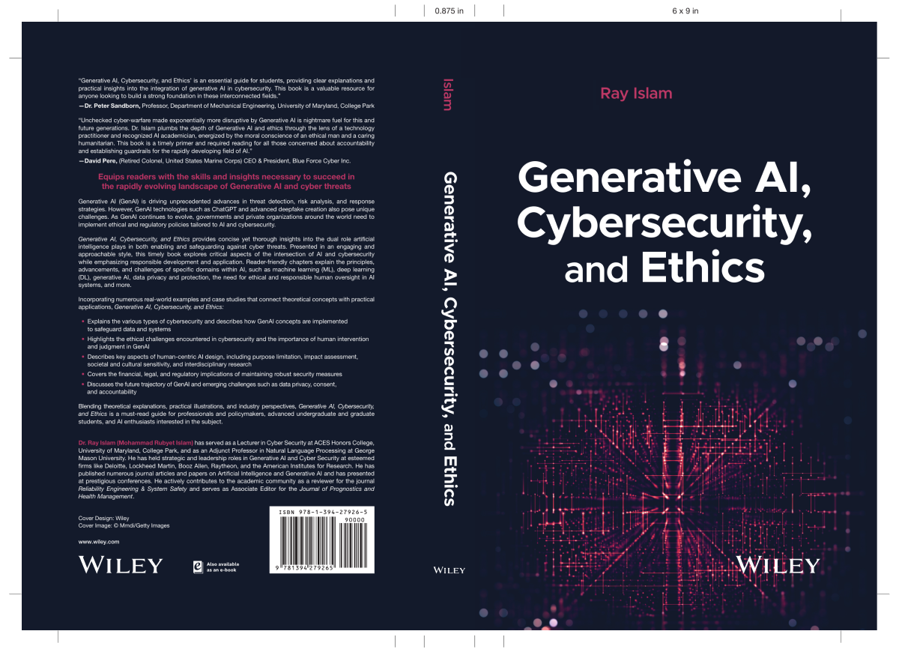

<html lang="en">
<head>
    <meta charset="UTF-8">
    <meta name="viewport" content="width=device-width, initial-scale=1.0">
    <title>Menubar Example</title>
    
</head>
<body>

    <a class="active" href="https://ray-islam.github.io/">Home</a>
    <a href="https://ray-islam.github.io/book.html">Books</a>
    <a href="https://ray-islam.github.io/conference.html">Conferences</a>
    <a href="https://ray-islam.github.io/awardsnrecognitions.html">Awards & Recognitions</a>

     
 

     
 

     
 

</body>
</html>

<html lang="en">
<head>
    <meta charset="UTF-8">
    <meta name="viewport" content="width=device-width, initial-scale=1.0">
    <title>Color Box Highlight</title>
    
</head>
<body>

    <!-- Highlight box container -->
    
           
        <ul>
                <a href="https://forbesswitzerland.com/ray-islams-book-explores-ethics-in-generative-ai-and-cybersecurity/">
                    Dr. Ray Islam (Mohammad Rubyet Islam) is stepping in with a message in the artificial intelligence (AI) field, where innovation races ahead and ethical concerns trail behind. - Forbes
                </a>            
        </ul>
        
    

    

</body>
</html>

<ul style="color: green; font-family: 'Futura', serif; font-size: 17px; list-style-type: none; margin: 0; padding: 0; text-align: justify;">
    
## ABOUT
<b> Dr. Ray Islam (Mohammad Rubyet Islam) has distinguished himself in AI and Machine Learning leadership at top global firms and through teaching at prestigious universities, effectively bridging the gap between academia and industry. He has led high-stakes AI and cybersecurity projects, managing multimillion-dollar initiatives across healthcare, finance, manufacturing, retail, and insurance. With teams across three continents and five degrees from five countries, he showcases global expertise. A seasoned researcher, associate editor, and published author, he has been recognized in Marquis Who’s Who in America (2024-25).</b>

</ul>

## RESEARCH INTEREST

<b>Finance, Generative AI, AI in Cyber Security, Ethics in AI</b>

## PROJECT/RESEARCH PORTFOLIOs

### Industry
<ul style="color: black; font-family: 'Futura', serif; font-size: 16px; list-style-type: none; margin: 0; padding: 0; text-align: justify;">
Specialized in AI/ML for financial fraud detection, wealth management, alpha generation, stock prediction, and point-of-sale anomaly identification. Expertise in multi-modal GenAI for decision-making, FedRAMP-compliant big data architecture, and GenAI-powered OCR for document analysis. Skilled in advanced data mining for cross-project insights, cyber anomaly detection using CNNs and auto-encoders, predictive modeling for KPI forecasting (SCI, CPI, Red Program), and AI-driven computer vision for image reconstruction, edge detection, and object identification.
</ul>
 

### Academia
<ul style="color: black; font-family: 'Futura', serif; font-size: 16px; list-style-type: none; margin: 0; padding: 0; text-align: justify;">
Developed novel ML-based RUL estimation for software systems, analyzing processor and clock speed impact. Optimized nanosphere solubility for targeted drug delivery and enhanced processes for energy-efficient composite materials.
</ul>

## EDUCATION 

### Complete

1. <b>Doctor of Philosophy (PhD)</b> in Machine Learning (Department of Mechanical Engineering)– UNIVERSITY OF MARYLAND – College Park, MD, USA.

<b>Dissertation:</b> A novel methodology to estimate Remaining Useful life of Software System using Machine Learning Methodologies (NLP+clustering+other statistical methods)

<b>Advisory Committee:</b> <a href="https://enme.umd.edu/clark/faculty/582/Peter-Sandborn">Dr. Peter A. Sandborn (Advisor and Chair) </a> | <a href="https://isr.umd.edu/clark/faculty/902/William-Regli">Dr. William Regli</a> (Dean’s Representative) | <a href="https://enme.umd.edu/clark/faculty/568/Mohammad-Modarres">Dr. Mohammad Modarres</a> | Dr. Abhijit Dasgupta | Dr. F. Patrick McCluskey 

2. <b>MASc</b> in Mechanical Engineering – ONTARIO TECH UNIVERSITY – ON, Canada, GPA:3.98 (Research undertaken at The Univesity of Toronto, Canada) 

<b>Advisory Committee:</b> <a href="https://ontariotechu.ca/experts/feas/ghaus-rizvi.php?utm_source=featured_expert&utm_medium=web&utm_campaign=Ghaus%20Rizvi">Dr. Ghaus Rizvi</a> (Advisor and Chair) | Dr. Remon Pop-Iliev | Dr. Yuping He | <a href="https://mse.utoronto.ca/faculty-staff/professors/naguib/">Dr. Hani Naguib</a> (External- Univerity of Toronto) 

3. <b>MSc</b> in International Marketing – HERIOT-WATT UNIVERSITY – UK 

  <b>Advisor:</b> <a href="https://www.hw.ac.uk/tex/people/faculty/britta-kalkreuter.htm">Dr. Britta Kalkreuter</a> 

  

4. <b>MBA</b> in Marketing – LUTON – UK  
5. <b>BSc</b> in Manufacturing Engineering – BUTex - BD, GPA: 4.0 

### In-progress

6. <b>Micro Masters</b> in Statistics and Data Science - Massachusetts Institute of Technology (MIT), USA 

### Transferred

1. Graduate Student in <b>PhD</b> in Mechanical Engineering - Geroge Washington University, DC, USA (Switched to University of Maryland, College Park, MD, USA)

 

2. Graduate Student in <b>PhD</b> in Mechanical Engineering - University of Toronto, Canada (Switched to George Washington Univerity, DC, USA)

  <b>Advisor:</b> <a href="https://www.mie.utoronto.ca/faculty_staff/park/">Dr. Chul B. Park</a>

## EXPERIENCE

## Industrial Experience
<ul style="color: black; font-family: 'Futura', serif; font-size: 16px;">
Leadership & AI Scientist roles in:
  Deloitte, USA | Raytheon, USA | Booz Allen Hamilton, USA | Lockheed Martin, USA | General Services Administration (GSA) - Contract | American Institutes for Research (AIR), Washington, D.C. | Euro Nassa Ltd., UK | Carrefour - France (Indian Sub-continent Office)|
</ul>

### Clients Worked For
<ul style="color: black; font-family: 'Futura', serif; font-size: 16px;">
<li>Finance: Berkshire Hathaway, USA | Capital One Bank, USA | U.S. Department of Commerce, USA </li>
<li>Health Care: US Department of Vaterans Affairs, USA |Centers for Medicare & Medicaid Services (CMS), USA | Pharmacy Data Analysis (e.g. CVS, Walgreens), USA</li>
<li> Education: US Department of Education, USA </li> 
<li> Others: The White House, USA | US Airforce (USAF), USA | The United States Department of Justice (DOJ), USA | The National Aeronautics and Space Administration (NASA), USA </li>
</ul>

## Academic Experience
<ul style="color: black; font-family: 'Futura', serif; font-size: 16px;">
<li>
  <b>Adjunct Professor</b>, Information Sciences and Technology, <a href="https://www.coursicle.com/gmu/professors/Mohammad+Islam/">George Mason University, Fairfax, VA, USA</a> 
    <ul> Course Taught:   
      <li>AIT 526: Natural Language Processing (Generative AI) – Graduate course</li>
    </ul>
</li>
</ul>

<ul style="color: black; font-family: 'Futura', serif; font-size: 16px;">
<li>
  <b>Lecturer</b>, ACES Honors College, University of Maryland, College Park, MD, USA
  <ul> Courses Taught:  
   <li>HACS100 Foundations in Cybersecurity - Undergraduate Course</li>  	         	       
   <li>HACS200 - Applied Cybersecurity Foundations II - Undergraduate Course</li>   
  </ul>
</li>
</ul>

<ul style="color: black; font-family: 'Futura', serif; font-size: 16px;">
<li>
  <b>Founder/Course Designer/Instructor</b>, Kindidata, VA (Boot Camp- https://kindideta.com/)
  <ul>Courses Taught: 
    <li>Data Visualization</li>
    <li>Natural Language Processing (NLP)</li>
    <li>Big Data Engineering</li>
  </ul>
</li>
</ul>

<ul style="color: black; font-family: 'Futura', serif; font-size: 16px;">
<li><b>Teaching Assistant</b>, University of Toronto, Ontario, Canada				  
  <ul>Course Taught: 
    <li>Advanced Manufacturing Technologies - Undergraduate Course</li>
  </ul>
</li>
</ul>

<ul style="color: black; font-family: 'Futura', serif; font-size: 16px;">
<li>
  <b>Teaching Assistant</b>, Ontario Tech University, Ontario, Canada
  <ul>Courses Taught: 
    <li>Statistics and Probability for Engineers - Undergraduate Course</li>
    <li>Engineering Design - Undergraduate Course</li>
  </ul>
</li>
</ul>
    
## PUBLICATIONS & AWARDS

### Book   
<ul style="color: black; font-family: 'Futura', serif; font-size: 16px;">
 <li> <b> <a href="https://www.wiley.com/en-us/Generative+AI%2C+Cybersecurity%2C+and+Ethics-p-9781394279265">Islam, M. R. (2025). Generative AI, Cybersecurity, and Ethics. Wiley, USA. ISBN: 978-1-394-27926-5.</a> 
</b></li> </ul>

#### [Check Global Availability Here](book.md)

### Peer-Reviewed Research Journal
<ul style="color: black; font-family: 'Futura', serif; font-size: 16px;">
<li> [J1]  <a href="https://doi.org/10.22215/jphm.v3i1.3641">Islam, R. and Sandborn, P., (2023), Demonstration of a Response Time Based Remaining Useful Life (RUL) Prediction for Software Systems, Journal of Prognostics and Health Management, 3(1), 9–36. February https://doi.org/10.22215/jphm.v3i1.3641.</a></li>
<li> [J2] <a href="https://doi.org/10.1177/0892705712439563"> Adhikary, K., Islam, R., Rizvi, G., Park, C., (2013), A Paper on Optimization of Process Conditions, Journal of Thermoplastic Composite Materials, 26(8):1127-1144, September, DOI: 10.1177/0892705712439563.</a></li>
<li> [J3]  <a href="https://doi.org/10.1177/0892705710388590"> Adhikary, K., Islam, R., Rizvi, G., Park, C., (2011), A paper on  Process Conditions Optimization, Journal of Thermoplastic Composite Materials, 24(2):155-17, March, DOI: 10.1177/0892705710388590.</a></li>
</ul>

### Conference Papers & Poster Presentations - Go to [conference page](conference.md)
<ul style="color: black; font-family: 'Futura', serif; font-size: 16px;">
<li> [C1]       <a href="https://link.springer.com/chapter/10.1007/978-3-031-62281-6_34">Islam, R. and Sandborn, P., (2024), Analyzing the Influence of Processor Speed and Clock Speed on Remaining Useful Life Estimation of Software Systems, Computing Conference, 11-12 July 2024, London, UK, Published as Proceedings on Springer Nature, DOI:
https://doi.org/10.1007/978-3-031-62281-6_34</a> 
</li>
<li> [C2]       <a href="https://doi.org/10.1115/DETC2021-70508">Islam, R. and Sandborn, P., (2021), Application of Prognostics and Health Management (PHM) to Software System Fault and Remaining Useful Life (RUL) Prediction, ASME 2021 International Design Engineering Technical Conferences and Computers and Information in Engineering Conference, August, DOI: 10.1115/DETC2021-70508</a> 
</li>
<li> [C3-C11]   <a href="https://www.researchgate.net/profile/Rubyet-Islam/publications">9 conference papers presented at esteemed conferences in the USA and Canada.</a>
</li>
<li> [P1-P5]    <a href="https://www.researchgate.net/profile/Rubyet-Islam/publications">5 posters presented at mainstream conferences in the USA and Canada. </a>
</li>
</ul>

### <a href="https://www.amazon.com/-/e/B0CP85GTJN">eBooks (amazon.com)</a>
<ul style="color: black; font-family: 'Futura', serif; font-size: 16px;">
<li>eBook1: Ray Islam, LangChain Unveiled: Navigating the Future of LLM, (Amazon, 2023)</li>
<li>eBook2: Ray lam, Enhancing Satellite Security: Leveraging GenAI for Advanced Cyber Defense, (Amazon, 2023)</li>
<li>eBook3: Ray Islam, Retrieval-Augmented Generation (RAG): Empowering Large Language Models (LLMs), (Amazon 2023)</li>
</ul>

### <a href="https://rayislam.medium.com/">White Papers (medium.com)</a>
<ul style="color: black; font-family: 'Futura', serif; font-size: 16px;">
<li> Islam, R., (2023), Prompt tuning for Large Language Models (LLMs)</li>
<li> Islam, R., (2023), Analytics Operating Eco (OE) System</li>
<li> Islam, R. (2023), AI for C-Suite Decision Making</li>
<li> Islam, R., (2023), CTGAN for Credit Card Analysis Synthetic Data</li>
<li> Islam, R., (2023), Unveiling the Potential of CTGAN: Harnessing Generative AI and 50K Synthetic IRIS Dataset</li>
</ul>

### Awards & Honors
<ul style="color: black; font-family: 'Futura', serif; font-size: 16px;">
1.	Nathan and Marvin Goldman/Durham Homes Graduate Award for reducing environmental impact of residential construction/maintenance and improving building energy technologies, Canada. 
2.	1st prize, Highly Qualified Personnel (HQP) poster competition award, governed by the Natural Sciences and Engineering Research Council of Canada (NSERC). 
3.	The NSERC Strategic Network Grant for PhD research, Canada. 
4.	Fellowship funded by the US Department of Energy for PhD research on Nanocomposites, USA. 
5.	Post Graduate Merit Award, Heriot-Watt University, UK
</ul>

### Editorial Services
<ul style="color: black; font-family: 'Futura', serif; font-size: 16px;">
<li>Reviewer: Conference: The International Conference on Learning Representations (ICLR), ICLR Foundation </li>
<li>Reviewer: Journal: Reliability Engineering & System Safety, Published by Elsevier </li>
<li>Associate Editor: Journal of Prognostics and Health Management (JPHM) </li>
<li>Editor-in-Chief: International Journal for Ethics & AI – To be launched.</li>
</ul>

### Membership
<ul style="color: black; font-family: 'Futura', serif; font-size: 16px;">
<li>AAAI - Association for the Advancement of Artificial Intelligence</li>
</ul>
  
### Blogs
<ul style="color: black; font-family: 'Futura', serif; font-size: 16px;">
25+ blogs on AI advancements, covering Generative AI, prompt tuning, algorithmic trading, and applications in NLP, supply chains, and financial forecasting. They delve into AI ethics, GAN validation, and AI's transformative impact on healthcare, cybersecurity, and education. <a href="https://medium.com/@rayislam" target="_blank">Click here</a> to read more on Medium.
</ul>

  
## PROFESSIONAL DEVELOPMENT

### Languages Speak: 
<ul style="color: black; font-family: 'Futura', serif; font-size: 16px;">
English | Bengali | Hindi | Urdu | French- basic |Arabic-basic.
</ul>

### Professional Training
<ul style="color: black; font-family: 'Futura', serif; font-size: 16px;">
<li> 6.419x: Certificate for Data Analysis: Statistical Modeling and Computation in Applications, MIT, MA</li>
<li> Tackling the Challenges of Big Data – Massachusetts Institute of Technology (MIT), MA</li>
<li> 18.6501x: Fundamentals of Statistics, Massachusetts Institute of Technology (MIT), MA</li>
<li> Teaching best practices training - University of Maryland, College Park, MD, USA</li>
<li> 200-A - FedRAMP System Security Plan (SSP) Required Documents</li>
<li> AWS Security Fundamentals (Second Edition)</li>
<li> Certified Scrum Master (CSM) (Expired)</li>
</ul>

## OTHERS

### Knowledge Share: 
<ul style="color: black; font-family: 'Futura', serif; font-size: 16px;">
<li>Youtube:@rayisl5382 </li>
<li>ORCID:0000-0002-8263-7560 </li>
<li>Medium:https://medium.com/@rayislam</li>
<li>Research Gate: https://www.researchgate.net/profile/Rubyet-Islam</li>
<li>KDNuggets:Unveiling the Potential of CTGAN: Harnessing Generative AI for Synthetic Data </li>
<li>Google Scholar:https://scholar.google.com/citations?user=yeHFzdoAAAAJ&hl=en&authuser=1</li>
</ul>

### Invited Panels and Guest Speaker

**USA**
<ul style="color: black; font-family: 'Futura', serif; font-size: 16px;">
<li>	Invited Guest Speaker- Symposium: The trends of Cancer Research, and Dynamic Challenges of CyberSecurity, Nov 2023, Supported by Robert H. Smith School of Business, University of Maryland, College Park, MD, USA</li>
<li>	Hackathon Judge - AI based models for Crypto Currency, 2022, by Deloitte at the University of Maryland.</li>
</ul>

**International**
<ul style="color: black; font-family: 'Futura', serif; font-size: 16px;">
<li>Invited guest speaker, Green University, 2024 - Applications of AI in Manufacturing(Online).</li>
<li>Invited guest speaker, Bangladesh University of Textiles, 2020 - Applications of AI in Manufacturing.</li>
<li>Invited Guest Speaker, North South University, Bangladesh, 2018 - AI and their applications. </li>
</ul>

### Other Activities and Social Contributions
<ul style="color: black; font-family: 'Futura', serif; font-size: 16px;">
<li>	Motivational speaker for the local South-East Asian community on How to become a data scientist.</li>
<li>  <a href="https://www.prothomalo.com/lifestyle/%E0%A6%B0%E0%A7%81%E0%A6%AC%E0%A6%BE%E0%A6%87%E0%A7%9F%E0%A6%BE%E0%A7%8E-%E0%A6%87%E0%A6%B8%E0%A6%B2%E0%A6%BE%E0%A6%AE-%E0%A6%86%E0%A6%97%E0%A7%8D%E0%A6%B0%E0%A6%B9-%E0%A6%86%E0%A6%B0-%E0%A6%AE%E0%A7%87%E0%A6%A7%E0%A6%BE-%E0%A6%A5%E0%A6%BE%E0%A6%95%E0%A6%B2%E0%A7%87%E0%A6%87-%E0%A6%A1%E0%A7%87%E0%A6%9F%E0%A6%BE" target="_blank"> Featured in Bangladesh’s Leading Newspaper, The Daily Prothom Alo, 5th January, 2020.</a></li>
<li>	Attended podcasts in Bangladesh on August 23rd, 2020, to inspire the younger generation.</li>
<li><a href="https://www.observerbd.com/details.php?id=126845" target="_blank">Islam, Rubyet. "Published article on Data Science." The Daily Observer, 11 Mar. 2018.</a></li>
<li>	Published two poetry books in Bengali.</li>
</ul>
